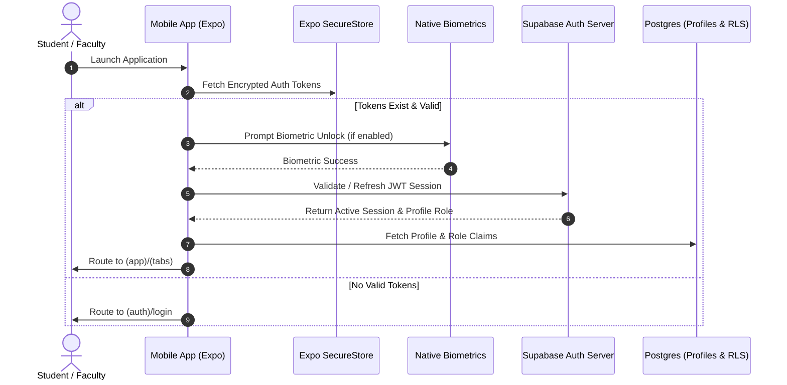

# CampusTracker Mobile — Authentication & Security Architecture

**Document Identifier**: `DOC-MOB-003`  
**Phase**: 4B — Architectural Blueprint  
**Status**: APPROVED  
**Author**: Mobile Security Engineer & Backend Architect  

---

## 1. Authentication Architecture Overview

Authentication in CampusTracker Mobile integrates natively with Supabase Auth while providing a frictionless, enterprise-grade security model tailored for student and faculty mobile usage. The architecture supports Email/Password, Native Google OAuth, Biometric Quick Unlock (FaceID/TouchID), and Role-Based Access Control (RBAC).



---

## 2. Authentication Pathways

### 2.1 Student Login
- **Identifiers**: College Email Address (e.g., `student@college.edu`) or Student Roll Number mapped to Email.
- **Credentials**: Passwords verified via Supabase Auth `signInWithPassword`.
- **Onboarding Flow**: Checks `profiles.onboarding_completed`. If `false`, redirects to `(auth)/onboarding` to select department, branch, semester, and roll number.

### 2.2 Faculty Login
- **Identifiers**: Institutional Faculty Email (e.g., `faculty@college.edu`).
- **Role Verification**: On successful auth, the app queries `profiles.role`. If role equals `'faculty'`, access is granted to Faculty Tab Routes. If role is `'student'`, login is rejected with a role mismatch error.

### 2.3 Future Admin Mobile Access
- **MFA Requirement**: Admin logins require mandatory Multi-Factor Authentication (TOTP / Authenticator App).
- **Session Timeout**: Admin sessions feature a strict 15-minute inactivity lock triggering biometric re-authentication.

### 2.4 Native Google OAuth Integration
- **Flow**: Uses Native Google Sign-In SDK (`@react-native-google-signin/google-signin`).
- **Token Exchange Process**:
  1. App calls Native Google SDK to present native system auth modal.
  2. Native Google SDK returns an OAuth `idToken`.
  3. App passes `idToken` to Supabase Auth via `supabase.auth.signInWithIdToken({ provider: 'google', token: idToken })`.
  4. Supabase validates Google JWT signature and returns a valid Supabase access + refresh token pair.

---

## 3. Biometric Authentication Architecture

Biometrics (FaceID on iOS, Biometric Prompt on Android) act as a secure local unlock mechanism over an existing valid session token.

```
┌────────────────────────────────────────────────────────────────────────┐
│                        BIOMETRIC UNLOCK FLOW                           │
│                                                                        │
│ ┌────────────────┐   Success  ┌────────────────┐   Valid  ┌──────────┐ │
│ │ Expo LocalAuth │───────────►│ Decrypt Master │─────────►│ Hydrate  │ │
│ │ Prompt Modal   │            │ Keychain Key   │          │ AuthState│ │
│ └────────────────┘            └────────────────┘          └──────────┘ │
│         │                             │                        │       │
│      Failure                       Invalid                  Expired    │
│         ▼                             ▼                        ▼       │
│ ┌────────────────────────────────────────────────────────────────────┐ │
│ │ Fall back to Primary Password / Pin Authentication Dialog          │ │
│ └────────────────────────────────────────────────────────────────────┘ │
└────────────────────────────────────────────────────────────────────────┘
```

- **Library**: `expo-local-authentication`.
- **Implementation**:
  - Biometrics DO NOT replace server authentication tokens.
  - When enabled, the app encrypts a local session unlocking secret inside `Expo SecureStore` requiring `requireAuthentication: true` flag.
  - When the app is backgrounded for over **5 minutes**, the UI locks and requires biometric scan to decrypt the session secret and resume usage.

---

## 4. Session & Token Lifecycle Management

| Token Type | Lifetime | Storage Location | Security Enforcement |
| :--- | :--- | :--- | :--- |
| **Access Token (JWT)** | 1 Hour (60 mins) | Memory (`useAuthStore`) + SecureStore fallback | Encrypted in memory; attached to `Authorization: Bearer` header on all API requests. |
| **Refresh Token** | 30 Days (Rolling) | Hardware-backed `Expo SecureStore` | Never stored in unencrypted storage or MMKV. Rotated on every refresh call. |
| **Biometric Secret** | Persistent | `Expo SecureStore` (Biometric Guarded) | Hardware-bound key requiring user biometric authorization to decrypt. |

### 4.1 Auto-Login Protocol
1. App boots and invokes `initAuthSession()` inside root layout `_layout.tsx`.
2. App reads stored refresh token from `Expo SecureStore`.
3. If refresh token is present, calls `supabase.auth.refreshSession()`.
4. On success: Updates Zustand `authStore` state (`isAuthenticated: true`), sets up auto-refresh timer, and proceeds to main UI.
5. On failure (token revoked or expired): Triggers logout sequence.

### 4.2 Refresh Interceptor
An Axios/Fetch interceptor in `packages/api` catches `401 Unauthorized` responses. It queues failing requests, executes a single asynchronous token refresh request, updates the stored access token, and retries the queued requests seamlessly.

### 4.3 Secure Logout Sequence
When the user clicks "Log Out" or a session is remotely revoked:
1. `supabase.auth.signOut()` is executed to invalidate the refresh token on the server.
2. `Expo SecureStore` keys (`supabase_access_token`, `supabase_refresh_token`, `biometric_key`) are deleted via `deleteItemAsync()`.
3. TanStack Query cache is purged: `queryClient.clear()`.
4. MMKV user session data is wiped. User offline UI preferences (e.g., dark theme setting) are preserved.
5. Navigation stack resets to `(auth)/login`.

---

## 5. Password Reset & Deep Link Handling

- **Request**: User submits email on `(auth)/forgot-password`.
- **Supabase Action**: Generates magic link redirect URL pointing to `campustracker://auth/reset-password?token=...`.
- **Mobile Handling**:
  - Expo Router catches deep link scheme via `app/auth/reset-password.tsx`.
  - Extracts recovery token from URL query params.
  - Verifies token with Supabase and presents "Enter New Password" input screen.
