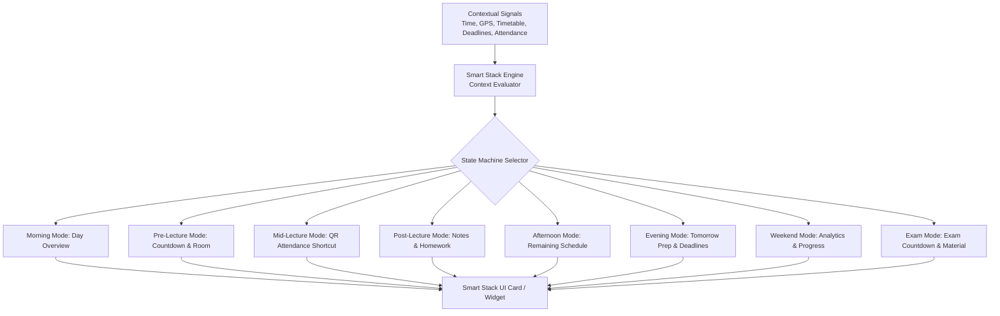

# CampusTracker Mobile — Monorepo & System Architecture

**Document Identifier**: `DOC-MOB-001`  
**Phase**: 4B — Architectural Blueprint  
**Status**: APPROVED  
**Author**: Principal Mobile Architect & Staff Engineering Team  

---

## 1. Executive Summary

CampusTracker Mobile is designed as the daily productivity companion for students and faculty across college campuses. Unlike traditional administrative ERP applications, CampusTracker Mobile prioritizes speed, offline resilience, low-latency interaction, and intelligent automation.

The mobile codebase lives within a TypeScript monorepo alongside the existing production Next.js web application. The web application remains untouched as the administrative control center, while `apps/mobile` leverages shared TypeScript packages for types, API clients, validation logic, and utility functions.

---

## 2. Monorepo Architecture & Package Breakdown

```
CampusTracker/
├── apps/
│   ├── web/                     # Next.js 14 Web Control Center (Untouched)
│   └── mobile/                  # Expo / React Native Production App
│
├── packages/
│   ├── shared/                  # Shared domain constants & validation schemas
│   ├── api/                     # Supabase client SDK & API repository methods
│   ├── types/                   # Single source of truth TypeScript types & DB interfaces
│   ├── utils/                   # Shared helpers (date math, formatting, calculations)
│   └── config/                  # Shared ESLint, TSConfig, Tailwind/NativeWind tokens
│
├── docs/                        # Engineering Architecture Specs
├── supabase/                    # Migrations, RLS policies, Edge Functions
├── turbo.json                   # Turborepo task pipeline & caching config
└── package.json                 # Monorepo root scripts & pnpm/npm workspace config
```

### Monorepo Build Orchestration: Turborepo (`turbo`)
To accelerate CI/CD build speeds and local DX, the monorepo incorporates **Turborepo**.
- **Task Caching**: Caches build outputs, TypeScript type checks (`turbo run check-types`), and linting across packages.
- **Dependency Pipeline**: Guarantees `packages/*` are type-checked and compiled before `apps/mobile` or `apps/web` run validation scripts.


### Package Responsibilities & Boundaries

#### `apps/mobile`
- **Scope**: Expo Managed app using Expo Router v3+ file-based routing.
- **Responsibilities**: Mobile UI components, gesture handlers, native navigation, mobile-specific hooks, local MMKV/SQLite caches, background task handlers, push notification listeners, widget bridges.
- **Forbidden Content**: Direct API transport definitions or duplicated database type definitions.

#### `packages/types`
- **Scope**: Pure TypeScript interfaces and type definitions.
- **Responsibilities**: Supabase generated database types (`database.types.ts`), mobile app domain models, Smart Stack context state interfaces, API request/response payloads, navigation type definitions.
- **Dependencies**: None.

#### `packages/shared`
- **Scope**: Common business constants and Zod schemas.
- **Responsibilities**: Attendance status enums, threshold rules (e.g., 75% default target), notification type constants, Zod validation schemas for forms and API inputs.
- **Dependencies**: `packages/types`.

#### `packages/api`
- **Scope**: Data access layer and API client repositories.
- **Responsibilities**: Typed Supabase client instantiation, query builders, repository classes (`AttendanceRepository`, `TimetableRepository`, `AssignmentRepository`, `QRRepository`), mutation queue handlers, retry policies.
- **Dependencies**: `packages/types`, `packages/shared`.

#### `packages/utils`
- **Scope**: Pure utility functions with zero side-effects.
- **Responsibilities**: Date math (`date-fns` wrappers for ISO weekday alignment 1-7), attendance percentage calculators, string sanitizers, GPS distance math (Haversine formula), TOTP verification math.
- **Dependencies**: `packages/types`.

#### `packages/config`
- **Scope**: Shared tooling configuration.
- **Responsibilities**: Shared `tsconfig.base.json`, NativeWind design system tokens, color palettes, spacing variables.
- **Dependencies**: None.

---

## 3. Layered Clean Architecture inside `apps/mobile`

`apps/mobile` is structured into four explicit layers to prevent tight coupling between UI and platform APIs:

```
apps/mobile/src/
├── app/                         # Expo Router routes & layout trees
├── presentation/                # UI Layer
│   ├── components/              # Atomic UI components (Cards, Badges, Buttons)
│   ├── features/                # Feature modules (Timetable, QRScanner, SmartStack)
│   ├── hooks/                   # Custom UI & animation hooks
│   └── theme/                   # NativeWind theme wrapper & typography
│
├── domain/                      # Business Logic Layer
│   ├── smart-stack/             # Context evaluation engine & state machine
│   ├── attendance/              # Attendance threshold & penalty algorithms
│   └── notification/            # Local trigger rules engine
│
├── data/                        # Data & Caching Layer
│   ├── storage/                 # MMKV key-value stores & Expo SQLite DB setup
│   ├── sync/                    # Background sync queue & conflict resolvers
│   └── query/                   # TanStack Query query keys & options
│
└── infrastructure/              # Platform & Native Layer
    ├── biometrics/              # Expo LocalAuthentication bridge
    ├── secure-store/            # Expo SecureStore encrypted storage
    ├── location/                # Expo Location geofencing bridge
    ├── camera/                  # Expo Camera QR scanner handler
    ├── push/                    # Expo Notifications token & channel setup
    └── widget/                  # Native Widget bridge (Android/iOS)
```

---

## 4. CampusTracker Smart Stack™ Architecture

The **CampusTracker Smart Stack™** is the flagship intelligent dynamic companion of CampusTracker Mobile. Instead of requiring users to look at multiple static widgets or manually navigate deep screen hierarchies, the Smart Stack evaluates real-time contextual signals and dynamically presents the single most critical action or piece of information needed at any exact minute.



### 4.1 Context Evaluation Engine

The Smart Stack Engine runs on a 60-second evaluation loop in the foreground and a background fetch trigger. It consumes seven contextual input vectors:

1. **System Time & Date**: Current hour, minute, day of week, ISO week number.
2. **Timetable Schedule**: Active lecture slots for today, start/end times, classroom, faculty name.
3. **Attendance Status**: Current percentage per subject vs required target threshold (75%).
4. **Assignment Deadlines**: Assignments due within the next 24-48 hours.
5. **Academic Calendar**: Flag for Exam Week, Holidays, or Semester Break.
6. **Location Signal**: Whether student is currently inside the verified Campus Geofence.
7. **Unread Announcements**: High-priority notifications issued by faculty or administration.

### 4.2 State Machine & Mode Transitions

| Mode Name | Trigger Condition | Primary Content Shown | Quick Actions Provided |
| :--- | :--- | :--- | :--- |
| **Morning Mode** | 06:00 – 08:30 (Weekday) | Today's full lecture schedule timeline & weather/campus status. | View Full Timetable, Set Reminders |
| **Pre-Lecture** | 15–30 mins before lecture | Next lecture title, room number, faculty name, countdown timer. | Campus Map / Navigation, Note Draft |
| **Mid-Lecture** | During active lecture slot | Current lecture progress bar, attendance status for subject. | **Instant QR Attendance Scan** |
| **Post-Lecture** | 0–45 mins post lecture | Class completed confirmation, pending notes/assignments uploaded. | Upload Notes, View Assignment |
| **Afternoon** | 13:00 – 17:00 (Post classes) | Remaining classes today, current attendance overall summary. | Attendance Detail, Study Plan |
| **Evening** | 17:00 – 23:00 (Weekday) | Tomorrow's timetable preview, upcoming assignment deadlines. | Mark Assignment Done, Night Review |
| **Weekend** | Saturday – Sunday | Weekly attendance report, semester progress, workload analytics. | Weekly Insights, Archive Notes |
| **Exam Mode** | Days within Exam Window | Countdown to next exam, venue, syllabus coverage, revision notes. | Open Exam Syllabus, Revision Notes |

### 4.3 Background Refresh & Battery Optimization

- **Evaluation Frequency**: Low-overhead JavaScript timer running every 60 seconds when app is active.
- **Idle Behavior**: Timer suspends when app enters background. Background fetch runs via OS native job scheduler (WorkManager on Android, BackgroundTasks on iOS) constrained to **15-minute minimum intervals**.
- **Power Usage**: Uses ZERO continuous GPS tracking. Location is requested *only* on demand when entering Mid-Lecture mode or scanning QR code.
- **Memory Footprint**: Context state payload is under **2 KB** stored in MMKV for instant app boot restoration.

### 4.4 Offline Fallback Context Matrix

If device loses internet connectivity:
1. Engine falls back immediately to locally cached timetable database in SQLite/MMKV.
2. Timetable countdowns and class alerts continue operating with 100% precision using local device hardware clock.
3. Assignment due dates stored locally are evaluated offline.
4. Smart Stack UI displays a subtle "Offline Mode — Cached Schedule" indicator without interrupting operation.

### 4.5 Future Scaling: Faculty, Parent, and Admin Smart Stacks

- **Faculty Smart Stack**: Automatically transitions to "Broadcast QR Code" mode 5 minutes before scheduled class, shows real-time attendance scan counter during class, and prompts for assignment grading in the evening.
- **Parent Smart Stack**: Focuses on daily attendance alerts, fee payment deadlines, and overall semester academic standing.
- **Admin Smart Stack**: Focuses on campus-wide attendance statistics, server/service health, and instant broadcast announcement trigger.
