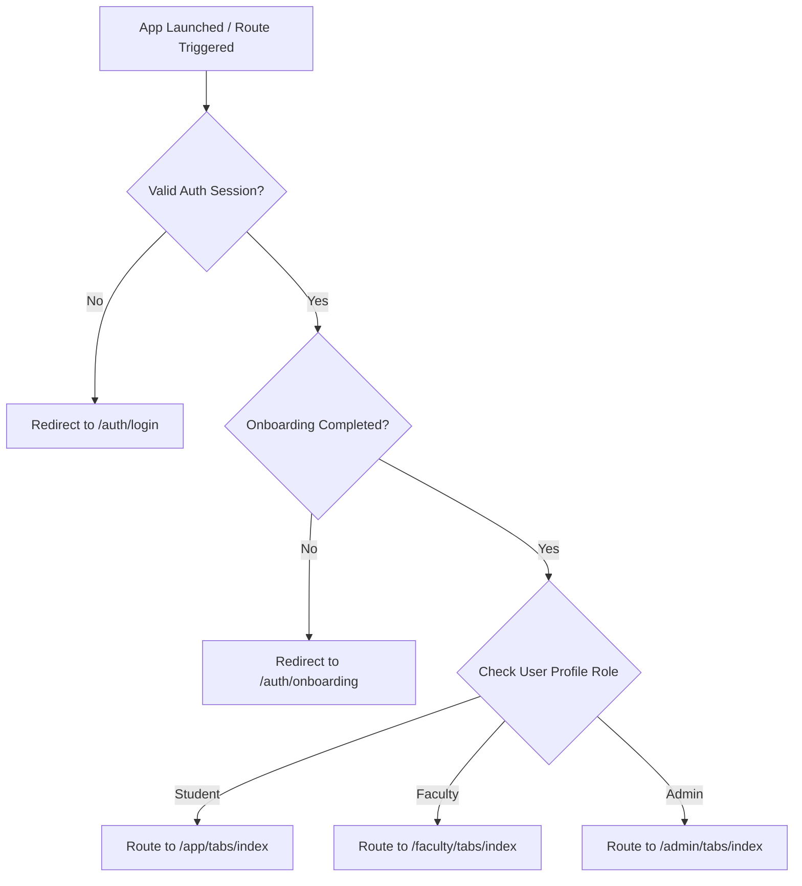

# CampusTracker Mobile — Navigation & Routing Architecture

**Document Identifier**: `DOC-MOB-004`  
**Phase**: 4B — Architectural Blueprint  
**Status**: APPROVED  
**Author**: Principal React Native Engineer  

---

## 1. Directory & File-Based Layout Architecture

CampusTracker Mobile uses **Expo Router v3+** for declarative, file-based routing. The screen hierarchy mirrors the web application while utilizing native animation stacks and native bottom tab bars.

```
apps/mobile/src/app/
├── _layout.tsx                  # Root Layout (Providers, Auth Listener, Splash Hide)
├── +not-found.tsx              # 404 Route Screen
├── +html.tsx                   # Web Fallback (if built for web)
│
├── (auth)/                      # Unauthenticated Auth Flow Stack
│   ├── _layout.tsx              # Stack Layout for Auth Screens
│   ├── login.tsx                # Email / Roll Number Login
│   ├── register.tsx             # Student Registration
│   ├── onboarding.tsx           # Department/Semester Setup Wizard
│   ├── forgot-password.tsx      # Email Password Reset Request
│   └── reset-password.tsx       # Deep link target for token entry
│
├── (app)/                       # Authenticated Protected Application Layout
│   ├── _layout.tsx              # Role Guard Layout (Student / Faculty Routing)
│   │
│   ├── (tabs)/                  # Main Student Bottom Tab Navigator
│   │   ├── _layout.tsx          # Custom Animated Bottom Tab Bar Layout
│   │   ├── index.tsx            # Home Dashboard & Smart Stack Widget
│   │   ├── timetable.tsx        # Day/Week Timetable View
│   │   ├── attendance.tsx       # Subject Attendance Analytics & Targets
│   │   ├── assignments.tsx      # Homework & Deadline Management
│   │   └── profile.tsx          # User Profile, Settings, & Dark Mode
│   │
│   └── subjects/                # Subject Detail Stack
│       ├── _layout.tsx          # Native Stack
│       └── [id].tsx             # Subject Detail, Notes, & Attendance Breakdown
│
├── (faculty)/                   # Authenticated Faculty Application Layout (Phase 4)
│   ├── _layout.tsx              # Faculty Role Guard Layout
│   └── (tabs)/                  # Faculty Bottom Tab Navigator
│       ├── index.tsx            # Faculty Dashboard & Class Overview
│       ├── qr-generator.tsx     # Active Dynamic QR Session Generator
│       └── class-reports.tsx    # Attendance Summary & Export Reports
│
└── modals/                      # Global Overlay Modals & Sheet Routes
    ├── _layout.tsx              # Modal Presentation Stack (`presentation: 'modal'`)
    ├── qr-scanner.tsx           # Full-screen Camera QR Scan Overlay
    ├── note-editor.tsx          # Rich Text / Markdown Note Creator
    ├── assignment-detail.tsx    # Assignment Submission Modal
    └── timetable-import.tsx     # Camera / PDF AI Timetable Upload Wizard
```

---

## 2. Protected Route Guards & Auth Routing

Navigation protection is driven by an explicit `useProtectedRoute` hook executed in `app/(app)/_layout.tsx`:



### Auth Guard Hook Specification (`useProtectedRoute`)
- Listens to Zustand `useAuthStore` (`user`, `session`, `role`, `isLoading`, `onboardingCompleted`).
- If `isLoading` is true, keeps native splash screen visible via `SplashScreen.preventAutoHideAsync()`.
- Once loaded:
  - Unauthenticated user attempting to access `(app)/*` or `(faculty)/*` is redirected to `(auth)/login`.
  - Authenticated user attempting to access `(auth)/*` is redirected to their primary role tab.
  - Student trying to access `(faculty)/*` receives access denied toast and is bounced back to student home.

---

## 3. Deep Linking & Universal Links Strategy

CampusTracker Mobile registers two deep link mechanisms:

1. **Custom URL Scheme**: `campustracker://` (Used for internal app redirects, local push notifications).
2. **Universal Links (iOS) & App Links (Android)**: `https://campustracker.app/` (Used for external links, email invites, password resets).

### Route Mapping Matrix

| External URL Pattern | Mobile Route Target | Action / Parameters Passed |
| :--- | :--- | :--- |
| `https://campustracker.app/assignments/:id` | `/(app)/modals/assignment-detail` | Opens assignment modal with `id` query parameter. |
| `https://campustracker.app/qr-scan` | `/(app)/modals/qr-scanner` | Immediately launches camera scanner modal. |
| `https://campustracker.app/subjects/:id` | `/(app)/subjects/[id]` | Pushes subject breakdown stack screen. |
| `https://campustracker.app/auth/reset-password` | `/(auth)/reset-password` | Passes reset token parameter to password reset form. |

---

## 4. Modal & Sheet Overlay Strategy

To ensure fluid, gesture-driven user interactions, CampusTracker Mobile divides overlays into two distinct UI primitives:

### 4.1 Native Stack Modals (`app/modals/*`)
- **Usage**: Full-screen workflows requiring full camera view, heavy inputs, or step-by-step wizards (e.g., QR Scanner, Timetable Import Wizard).
- **Configuration**: Standard Expo Router stack screen with `options={{ presentation: 'modal', headerShown: false }}`. Uses native OS slide-up transition.

### 4.2 Dynamic Bottom Sheets (`@gorhom/bottom-sheet`)
- **Usage**: Contextual quick actions, subject filter pickers, attendance status overrides, and note quick views.
- **Configuration**: Managed within the screen tree via Reanimated bottom sheets. Does not block full navigation stack; supports drag-to-dismiss gestures.
