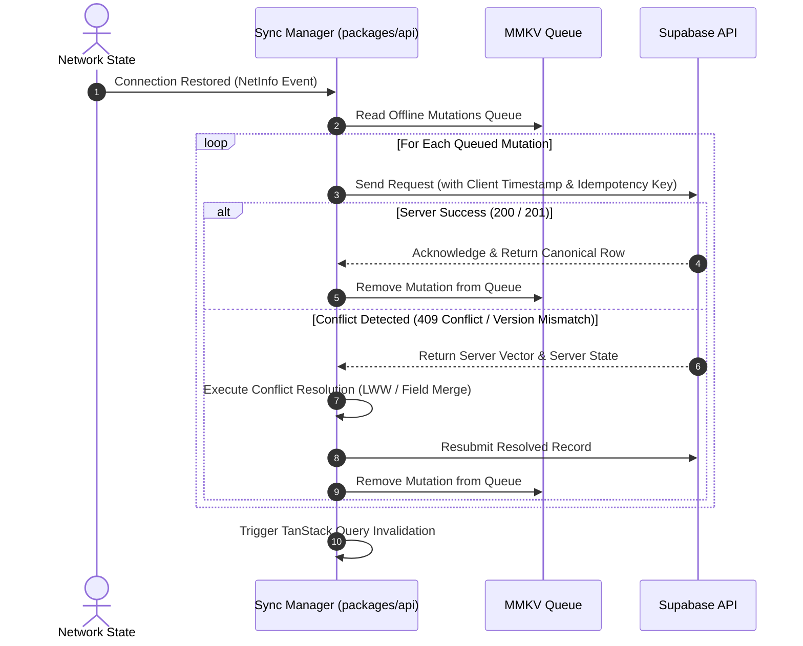

# CampusTracker Mobile — Offline-First Architecture & Sync Strategy

**Document Identifier**: `DOC-MOB-006`  
**Phase**: 4B — Architectural Blueprint  
**Status**: APPROVED  
**Author**: Site Reliability Engineer & Mobile Architect  

---

## 1. Multi-Tiered Storage & Offline Architecture

CampusTracker Mobile is engineered around an **Offline-First Paradigm**. Poor or absent campus Wi-Fi / cellular connectivity MUST NOT prevent a student or faculty member from viewing their timetable, reading class notes, reviewing assignment deadlines, or checking attendance percentages.

```
┌────────────────────────────────────────────────────────────────────────┐
│                        TIER 1: IN-MEMORY CACHE                         │
│     Active React State & TanStack Query In-Memory Cache (RAM)         │
├────────────────────────────────────────────────────────────────────────┤
│                     TIER 2: FAST MMKV KEY-VALUE STORE                  │
│     MMKV Persister: Auth Tokens, Smart Stack Context, Preferences     │
├────────────────────────────────────────────────────────────────────────┤
│                   TIER 3: LOCAL RELATIONAL SQLITE DB                   │
│     Expo SQLite DB: Timetables, Notes, Assignments, Attendance Logs    │
└────────────────────────────────────────────────────────────────────────┘
```

---

## 2. Storage Tier Specifications

### Tier 1: In-Memory RAM Cache
- **Technology**: TanStack Query v5 Cache.
- **Role**: Instant render pipeline for active screen components. Re-renders UI instantly without I/O blocking.

### Tier 2: Synchronous MMKV Storage
- **Technology**: `react-native-mmkv`.
- **Role**: Used by `@tanstack/react-query-persist-client` to serialize query snapshots to disk. Hydrates the app UI during cold boot in `< 50 ms`.

### Tier 3: Local Relational Database (Expo SQLite)
- **Technology**: `expo-sqlite` (or `op-sqlite`).
- **Schema**: Replicates Postgres table structures locally for queryable, offline relational access:
  - `local_subjects`
  - `local_timetable_slots`
  - `local_attendance_records`
  - `local_assignments`
  - `local_notes`

---

## 3. Offline Feature Capabilities

| Feature Domain | Offline Capability & Data Availability | Local Storage Mechanism |
| :--- | :--- | :--- |
| **Timetable** | **100% Offline**. Schedules, room numbers, faculty names, and class times available without network access. | Cached in SQLite `local_timetable_slots`. |
| **Notes** | **100% Offline Read & Create**. Reading existing notes, downloading attachments, and drafting new notes offline. | Text stored in SQLite `local_notes`; attachments cached in filesystem. |
| **Assignments** | **100% Offline Read & Status Update**. View assignment details, mark status as completed offline. | Cached in SQLite `local_assignments`. |
| **Attendance History**| **100% Offline Read**. View attendance percentage per subject, past attendance dates, and safety margins. | Cached in SQLite `local_attendance_records`. |
| **Smart Stack** | **100% Offline Engine**. Computes current/next class countdowns locally using device hardware clock. | Evaluated locally from SQLite schedule snapshot. |
| **QR Scan Attendance**| **Buffered Offline Queue**. Scans dynamic QR code offline, signs payload with local client certificate, and queues for auto-sync. | Saved in MMKV `offline_mutations_queue`. |

---

## 4. Conflict Resolution & Sync Protocol

When connectivity transitions from Offline to Online:



### Conflict Resolution Rules
1. **Idempotency**: Every offline mutation payload includes a client-generated UUID `idempotency_key`. The server rejects duplicate processing of retried mutations.
2. **Last-Write-Wins (LWW)**: For simple state changes (e.g. marking an assignment completed or changing theme settings), the record with the most recent ISO timestamp (`updated_at`) prevails.
3. **Field-Level Union**: For offline notes edited concurrently on web and mobile, non-conflicting fields are merged. If content body conflicts, a duplicate note is created titled `"Note Title (Mobile Offline Draft)"` to prevent data loss.

---

## 5. Cache Expiration & Revalidation Matrix

| Data Entity | Stale Time (`staleTime`) | Cache Time (`gcTime`) | Revalidation Trigger |
| :--- | :--- | :--- | :--- |
| **User Profile & Settings**| 24 Hours | 7 Days | App Boot / Settings Screen Opened |
| **Timetable Slots** | 12 Hours | 30 Days | Manual Refresh / AI Import Completed |
| **Subjects List** | 12 Hours | 30 Days | Manual Refresh / Subject Added |
| **Attendance Records** | 5 Minutes | 7 Days | QR Attendance Marked / Tab Focused |
| **Assignments** | 15 Minutes | 7 Days | App Foregrounded / Tab Focused |
| **Notes** | 30 Minutes | 14 Days | Note Selected / Created |
| **Notifications** | 2 Minutes | 3 Days | Realtime Signal / Tab Focused |
