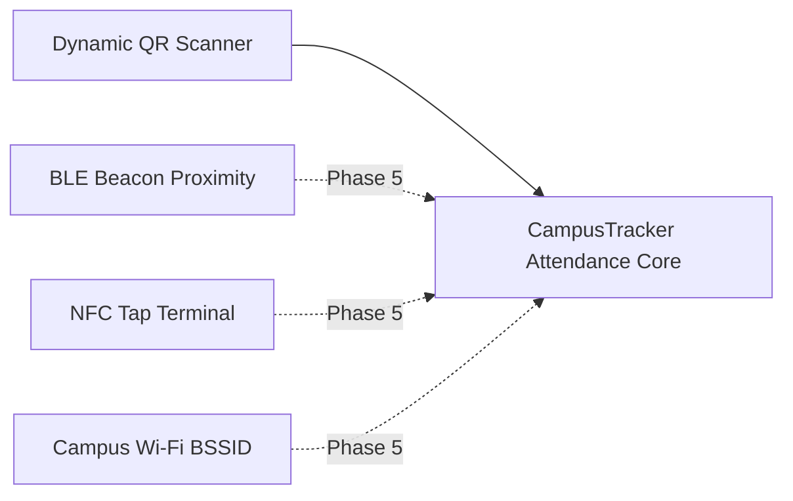

# CampusTracker Mobile — Smart QR Attendance System & Security Architecture

**Document Identifier**: `DOC-MOB-007`  
**Phase**: 4B — Architectural Blueprint  
**Status**: APPROVED  
**Author**: Mobile Security Engineer & Product Architect  

---

## 1. Smart QR Attendance Architecture Overview

Proxy attendance, screenshot sharing, and geolocation spoofing are major failure modes of traditional QR attendance solutions. CampusTracker Mobile implements a multi-layered, cryptographic **Smart QR Attendance System** that combines **Rotating Dynamic TOTP Payloads**, **GPS Geofence Validation**, and **Hardware Device Fingerprinting**.

```
┌─────────────────────────────────────────────────────────────────────────┐
│                          TEACHER / FACULTY DEVICE                       │
│ ┌─────────────────────────────────────────────────────────────────────┐ │
│ │ Faculty creates Attendance Session for Active Class Slot            │ │
│ └──────────────────────────────────┬──────────────────────────────────┘ │
│                                    │                                    │
│                                    ▼                                    │
│ ┌─────────────────────────────────────────────────────────────────────┐ │
│ │ Dynamic QR Code Generator (Rotates TOTP + AES Key every 5 Seconds)   │ │
│ └──────────────────────────────────┬──────────────────────────────────┘ │
└────────────────────────────────────┼────────────────────────────────────┘
                                     │ (Student Scans Screen)
                                     ▼
┌─────────────────────────────────────────────────────────────────────────┐
│                          STUDENT MOBILE DEVICE                          │
│ ┌─────────────────────────────────────────────────────────────────────┐ │
│ │ Expo Camera scans rotating QR payload                               │ │
│ └──────────────────────────────────┬──────────────────────────────────┘ │
│                                    │                                    │
│                                    ▼                                    │
│ ┌─────────────────────────────────────────────────────────────────────┐ │
│ │ Collect Device Hardware Fingerprint + Current GPS Coordinates       │ │
│ └──────────────────────────────────┬──────────────────────────────────┘ │
│                                    │                                    │
│                                    ▼                                    │
│ ┌─────────────────────────────────────────────────────────────────────┐ │
│ │ Call Supabase Edge Function: `verify-qr-attendance`                 │ │
│ └──────────────────────────────────┬──────────────────────────────────┘ │
└────────────────────────────────────┼────────────────────────────────────┘
                                     │
                                     ▼
┌─────────────────────────────────────────────────────────────────────────┐
│                         SUPABASE CLOUD VALIDATION                       │
│  1. Decrypt QR Payload & Verify TOTP Timestamp Window (<= 10s drift)   │
│  2. Haversine GPS Distance Check (Student vs Classroom Radius <= 30m)   │
│  3. Unique Device ID Verification (Prevent Proxy Multiple Logins)       │
│  4. Compute Confidence Score -> Write to `attendance_records`           │
└─────────────────────────────────────────────────────────────────────────┘
```

---

## 2. Dynamic QR Code Payload Cryptography

To prevent students from taking a photo/screenshot of the classroom QR code and sending it to absent classmates over chat apps, the QR code **rotates every 5 seconds**.

### 2.1 Payload Structure & Cipher Engine
The QR code encodes a base64url string containing an encrypted JSON envelope:

$$\text{QR Envelope} = \text{Base64Url}\left(\text{AES-256-GCM}\left(\text{Payload}, K_{\text{session}}\right) \parallel \text{HMAC-SHA256}\right)$$

Where `Payload` contains:
- `sessionId`: UUID of the teacher's active attendance session.
- `slotId`: UUID of the current timetable slot.
- `timestamp`: Unix epoch seconds (rotates every 5,000 ms).
- `totpToken`: Time-based one-time password generated from the session secret key.

---

## 3. Student Scan & Multi-Factor Verification Protocol

When a student taps "Mark Attendance" in their Smart Stack or opens the QR Scanner:

### Step 1: Payload Decryption & Expiry Check
- The app parses the scanned QR text and transmits it alongside the student's current GPS location and hardware device hash to the Supabase Edge Function `verify-qr-attendance`.
- If the scanned QR payload timestamp is older than **15 seconds**, the request is rejected immediately (`QR_SESSION_EXPIRED`).

### Step 2: GPS Geofence & Wi-Fi BSSID Hybrid Validation
The Edge Function calculates the distance between the student's current GPS coordinate $(lat_s, lon_s)$ and the classroom's registered geofence centroid $(lat_c, lon_c)$:

$$d = 2R \arcsin \left( \sqrt{ \sin^2\left(\frac{\Delta lat}{2}\right) + \cos(lat_s)\cos(lat_c)\sin^2\left(\frac{\Delta lon}{2}\right) } \right)$$

- **Allowed Distance ($d$)**: Must be $\le 30\text{ meters}$ (or within the college boundary polygon).
- **Wi-Fi BSSID Hybrid Verification**: In heavy indoor classroom environments where GPS satellite lock is degraded, the mobile app sends the SHA-256 hash of the connected Wi-Fi router BSSID. If the hash matches the college AP whitelist in `campus_geofences`, the location check passes with High Confidence even with weak GPS signals.
- **Location Spoof Detection**: The mobile app inspects location provider flags (`isMocked` / `isFromMockProvider`). If mock location is detected, the scan is blocked instantly.


### Step 3: Hardware Device Fingerprint Verification
- Every student device generates a cryptographically bound hardware device identifier stored in `Expo SecureStore` upon initial login.
- **Rule**: A single physical device cannot submit attendance for more than ONE student profile within the same 4-hour window. This completely eliminates proxy attendance where one student scans for multiple friends using switched accounts on the same phone.

---

## 4. Attendance Confidence Scoring Engine

Every attendance record marked via QR is assigned a system **Confidence Level**:

| Confidence Score | Conditions Met | Action Taken |
| :--- | :--- | :--- |
| **High Confidence** (Green) | Valid dynamic TOTP + GPS within 30m + Verified unique hardware device ID. | Attendance status set to `present` automatically. |
| **Medium Confidence** (Yellow)| Valid dynamic TOTP + Hardware verified, but GPS accuracy low (30m - 75m due to indoor signal drop). | Attendance set to `present` (Flagged for optional teacher audit). |
| **Low / Flagged** (Red) | Valid QR, but GPS outside geofence (> 75m) or mock location detected. | Attendance rejected; student prompted to send "Manual Override Request" to teacher. |

---

## 5. Teacher Manual Override & Session Lifecycle

1. **Session Start**: Teacher opens Faculty App -> Selects active class -> Tap "Start Attendance" -> System creates `qr_attendance_sessions` row with a 10-minute lifetime.
2. **Real-time Counter**: Teacher UI shows live count of scanned students updating via Supabase Realtime.
3. **Manual Override**: If a student's phone battery is dead, the teacher can tap the student's name in the class roster to manually mark them `present` (overriding hardware/GPS requirements).
4. **Session Closure**: After 10 minutes (or manual stop), the session expires. Further scans against that session ID return `SESSION_CLOSED`.

---

## 6. Future Hardware Extensions Roadmap



- **Bluetooth Low Energy (BLE)**: Faculty phone broadcasts a temporary BLE peripheral service ID. Student phone validates proximity via RSSI signal strength without needing GPS.
- **NFC Tag Tap**: Physical cryptographic NFC tags affixed to classroom lecterns for instant tap-to-attend.
- **Campus Wi-Fi BSSID Validation**: Verifies student's connected Wi-Fi router BSSID matches the college network access point hardware addresses.
