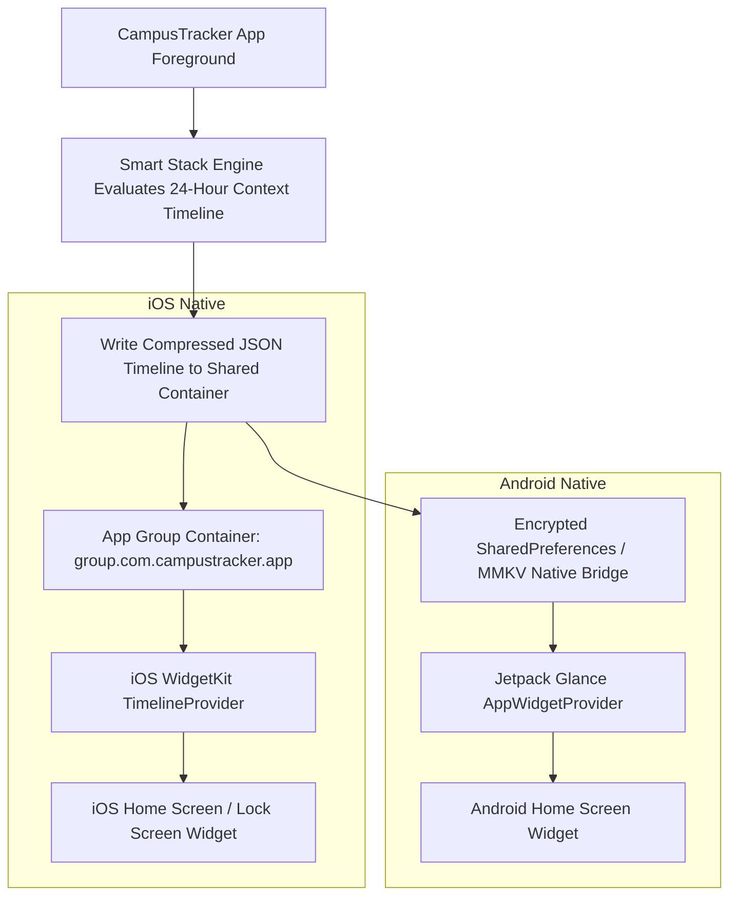

# CampusTracker Mobile — Native Widget System & Smart Stack Specifications

**Document Identifier**: `DOC-MOB-009`  
**Phase**: 4B — Architectural Blueprint  
**Status**: APPROVED  
**Author**: Principal Mobile Architect & Staff Engineer  

---

## 1. Widget Architecture Philosophy: The Smart Stack Widget Paradigm

Modern mobile users do not want home screens cluttered with five different single-purpose ERP widgets (one for timetable, one for attendance, one for notes, one for assignments, one for notices).

CampusTracker Mobile introduces the **Smart Stack Widget** as its default, primary home screen experience. The Smart Stack is a single intelligent widget that dynamically transforms its content, layout, and quick action buttons throughout the day based on contextual academic signals.

```
┌────────────────────────────────────────────────────────────────────────┐
│                        SMART STACK WIDGET PARADIGM                     │
│                                                                        │
│  07:00 AM ──► Morning Schedule Overview (Today's Classes & Weather)   │
│  09:45 AM ──► Pre-Lecture Countdown (Room 302 - Prof. Smith - 15m)     │
│  10:15 AM ──► Mid-Lecture Mode (⚡ Instant QR Attendance Button)        │
│  01:00 PM ──► Afternoon Summary (Attendance Status & Next Class)       │
│  06:00 PM ──► Evening Review (Tomorrow's Schedule & 2 Assignments Due)  │
└────────────────────────────────────────────────────────────────────────┘
```

---

## 2. Platform Widget Implementations

### 2.1 iOS Home & Lock Screen Widgets (WidgetKit & ActivityKit)

iOS widgets are built using Swift and SwiftUI via a custom Expo Config Plugin (`plugins/with-ios-widgets.js`) that embeds a native iOS Widget Extension into the Xcode build target.

#### Home Screen Widgets (`WidgetFamily`)
- `systemSmall`: Displays next lecture countdown or attendance safety meter.
- `systemMedium`: Smart Stack default widget showing active class, room, countdown, and instant action.
- `systemLarge`: Comprehensive daily timeline, pending assignments, and attendance breakdown.

#### Lock Screen Widgets (iOS 16+)
- `accessoryCircular`: Dynamic attendance percentage ring gauge.
- `accessoryRectangular`: Next class subject code, start time, and room number.
- `accessoryInline`: `"Next: CS301 in Rm 302 @ 10:00 AM"`.

#### Live Activities & Dynamic Island (ActivityKit)
- **Trigger**: Automatically activates 15 minutes prior to a scheduled lecture.
- **Dynamic Island Compact View**: Left: Subject icon; Right: Class countdown (`"12m"`).
- **Dynamic Island Expanded View**: Full lecture card with faculty name, classroom, and **"Scan Attendance"** quick button.
- **Lock Screen Live Activity Card**: Live updating timer bar showing lecture progress.

---

### 2.2 Android Widgets & Quick Settings Tiles

Android widgets are implemented via Jetpack Glance (Kotlin) managed through a custom Expo Config Plugin (`plugins/with-android-widgets.js`).

#### Home Screen AppWidget
- **Resizable Layouts**: Adapts from $2\times2$ small card to $4\times2$ full Smart Stack strip.
- **Interactive Buttons**: Supports Jetpack Glance `ActionCallback` buttons allowing students to tap "Mark Attendance" directly from the home screen, opening the QR Scanner instantly.

#### Android Quick Settings Tile (`QsTileService`)
- CampusTracker registers an Android Quick Settings Tile labeled **"Scan Attendance"**.
- Located in the Android top status bar pulldown menu.
- Tapping the tile unlocks the phone, bypasses the home screen, and opens `app/modals/qr-scanner.tsx` directly in $< 300\text{ ms}$.

---

## 3. Background Update Strategy & Shared Storage Container

Native widgets on iOS and Android run in separate system processes outside the main React Native JavaScript engine. To supply widgets with fresh data without draining device battery:



### Battery-Efficient Timeline Strategy
- **Zero Background Polling**: Widgets DO NOT trigger network requests or run JS background timers.
- **Timeline Pre-Generation**: Whenever the student opens the app or receives a push notification, the JS engine computes a **24-Hour Widget Timeline JSON** (a list of 24 snapshot entries, one for each hour/lecture transition).
- **Shared Storage**: The timeline is written to the native shared container (`App Group` on iOS, `SharedPreferences` on Android).
- **Native OS Execution**: The OS reads the pre-computed timeline natively at specified timestamps with ZERO battery penalty.

---

## 4. Primary vs Secondary Widgets Trade-off Analysis

| Metric / Dimension | Primary Smart Stack Widget | Secondary Specialized Widgets |
| :--- | :--- | :--- |
| **Home Screen Footprint** | Low (Single $4\times2$ card replacing multiple widgets). | High (Requires 3-4 separate widgets on screen). |
| **Cognitive Load** | Very Low (Displays only relevant information for current hour). | High (Student must scan multiple static widgets). |
| **Battery Consumption** | Minimal (Single timeline payload written to shared storage). | Moderate (Multiple native widget providers updating independently). |
| **User Preference** | Recommended default experience for 95% of users. | Supported for power users who prefer permanent static views. |
